# Pi Pico Andur

## Proto 0

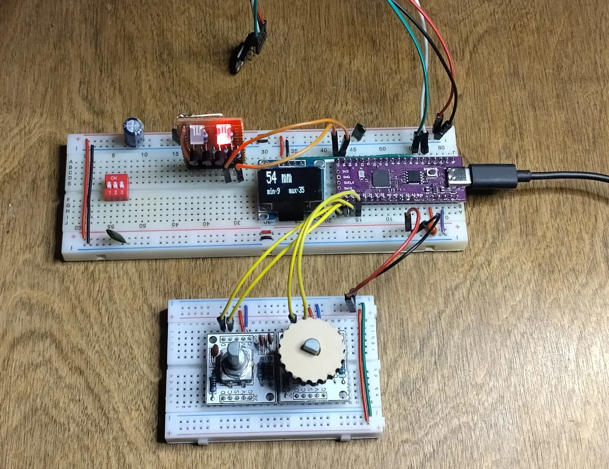

- https://www.instagram.com/reel/DPMSu_giLpH/?utm_source=ig_web_copy_link&igsh=MzRlODBiNWFlZA==
- https://www.instagram.com/reel/DPefCeejA3R/?utm_source=ig_web_copy_link&igsh=MzRlODBiNWFlZA==

## Proto 1 Jupid

Pilt|Nimi    | m    | m   |Kood
----|--------|------|-----|----
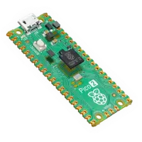|RASPBERRY PI PICO 2| Cortex-M33| |SC1631
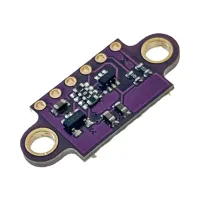|ToF / Laser moodul| VL53L0X 3-5VDC| I2C, 0.05÷1.2m | OKYN220420-17
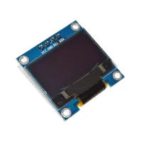|OLED display| 0.96''| Sinine ja valge| OKY4020
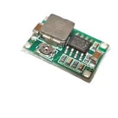|Toitemoodul DC/DC| step-down |4.75..23V/1..17 3A|OKY3504-1
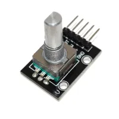|Rotary Encoder|-|-| OKY3431
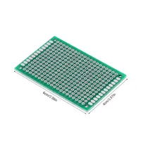|Makettplaat| 40*60mm |-|OKY0001-1-4X6CM
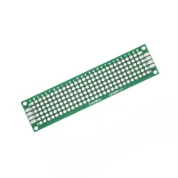|Makettplaat| 20*80mm| kahepoolne| OKN426-8
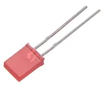|LED punane matt| 2*5mm| 5mcd| OLC2X5M0005
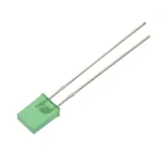|LED roheline matt| 2*5mm| 10mcd| LZ2X5M0010
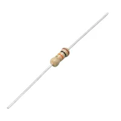|Takisti | 470R | 1/4W| -
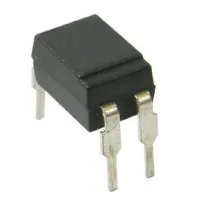|Optron|EL817C |-| PC817
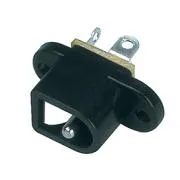|Toitepesa paneelile| 2.1/5.5mm| | PC-010
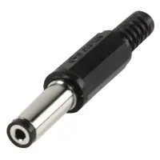|Pistik| 2.1/5.5mm| 14mm, plast| LUM-XNESJ210
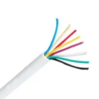|Signalisatsioonikaabel|8x0.22mm2 |tinatatud Valge|S8X022W
|Lintkaabel| 5*0.3mm2|-| LP05-RGBW
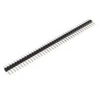|Piikriba |1*40pin| 2.54mm|CC078
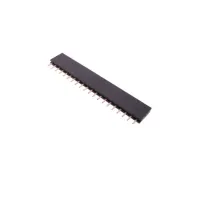|Piikriba pesa plaadile| 1*20pin |2.54mm |L20420GS
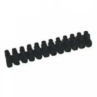|Kruviklemmliist| 12*2.5mm2| STCM-8471| EL-CONN040B
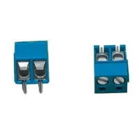|2-ne klemmliist pcb| 5.0mm| h=10mm 1.5mm2| TB-001LC
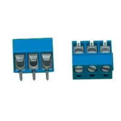|3-ne klemmiist. pcb| 5.0mm| h=12mm| TB-002
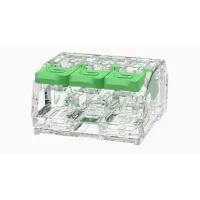|Ühendusklemm 3-ne| kangiga avatav ja suletav|-| DGBSC-SG01/4-03P
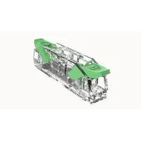|Ühendusklemm 2-ne| kangiga| läbiv|DGBSC-SG02/4-01P
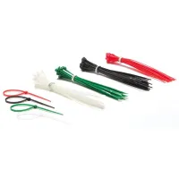|Kaablisideme komplekt| 160mm| Värvilised| ECTC160

Tauno Erik 2025